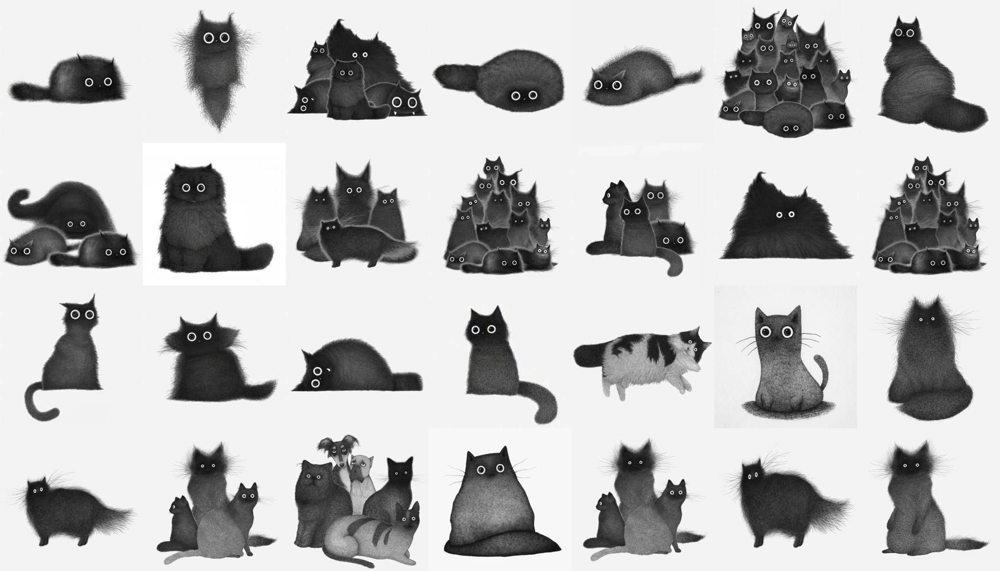

### ✨Rosalind Fok✨

<!--
**RosalindFok/RosalindFok** is a ✨ _special_ ✨ repository because its `README.md` (this file) appears on your GitHub profile.

Here are some ideas to get you started:

- 🔭 I’m currently working on ...
- 🌱 I’m currently learning ...
- 👯 I’m looking to collaborate on ...
- 🤔 I’m looking for help with ...
- 💬 Ask me about ...
- 📫 How to reach me: ...
- 😄 Pronouns: ...
- ⚡ Fun fact: ...
-->
#### Education
Bachelor of Engineering(computer science and technology): School of Computer Science and Technology, University of Chinese Academy of Sciences. My thesis was advised by [Beihong Jin](http://work.iscas.ac.cn/index.php/Jinbeihong/index/index) 
Master of Philosophy(computer science and technology): Center for Biomedical Information Technology, Institute of Advanced Computing and Digital Engineering, Shenzhen Institute of Advanced Technology, Chinese Academy of Sciences. I was advised by [Yunpeng Cai](https://szs.siat.ac.cn/#/detail?item=%5Bobject%20Object%5D&list=%5Bobject%20Object%5D&contentId=199)

#### Current Interests
Encoding and Decoding for higher cognitive function of human's brain. 
Incomplete understanding of the pathophysiology of mental disorders. 

